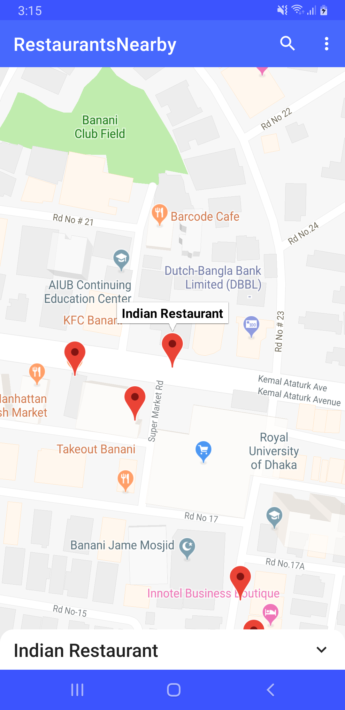

# Restaurant Finder

## Functional spec : 
We at Monstar Lab Bangladesh have a team party every month, every team goes out and has
lunch together to strengthen team bonding. However, we always have difficulty choosing a
restaurant. We could really use a web service which can help us pick a restaurant close to the
office without thinking too much. Sometimes we would also like to be able to search a place by
keyword around us. Please organize, design, test, and document your code as if it were going
into production. Then send us a link to the hosted repository (e.g., Github, Gitlab, Bitbucket, etc).
If you prefer you can create a private repository.

## Technical spec 
Please choose React or Angular depending on which tech position you are applying.
Feel free to use any other code libraries that mesh well with these. As for getting actual data for
the application, you can use the Foursquare Places API.
The functions we expect you to implement are:
1. Random selection of a restaurant within 1km of the Monstar Lab Bangladesh Office at Ahmed
Tower, Banani.
2. Provide a map view showing the location of the restaurant
3. Do a keyword search for restaurants within 1 km of the office

## Design partner : 
[MVVM](https://en.wikipedia.org/wiki/Model%E2%80%93view%E2%80%93viewmodel)

## Library
1. [APPCOMPAT ](https://developer.android.com/jetpack/androidx/releases/appcompat)
2. [MATERIAL](https://material.io/develop/android/docs/getting-started/)
3. [CONSTRAINT_LAYOUT](https://developer.android.com/training/constraint-layout)
5. [MATERIAL_SEARCHVIEW ](https://github.com/MiguelCatalan/MaterialSearchView)
6. [CALLIGRAPHY ](https://github.com/chrisjenx/Calligraphy)
7. [MAP ](https://developers.google.com/android/guides/setup)
8. [ARCHITECTURE COMPONENTS](https://developer.android.com/topic/libraries/architecture)
9. [RETROFIT](https://github.com/square/retrofit)
10. [RETROFIT_MOSHI_CONVERTER ](https://github.com/square/retrofit/tree/master/retrofit-converters/moshi)
11. [STETHO ](https://github.com/facebook/stetho)
12. [TIMBER ](https://github.com/JakeWharton/timber)
13. [DAGGER](https://github.com/google/dagger)
14. [LEAK_CANNARY](https://github.com/square/leakcanary)

## Navigation
1. [ActivityScreenSwitcher](https://github.com/RimonGazi/Restaurants-nearby/blob/master/app/src/main/java/com/rimon/restaurantsnearby/base/navigation/ActivityScreenSwitcher.java)
2. [FragmentScreenSwitcher](https://github.com/RimonGazi/Restaurants-nearby/blob/master/app/src/main/java/com/rimon/restaurantsnearby/base/navigation/FragmentScreenSwitcher.java)

## Screenshot

  

 

